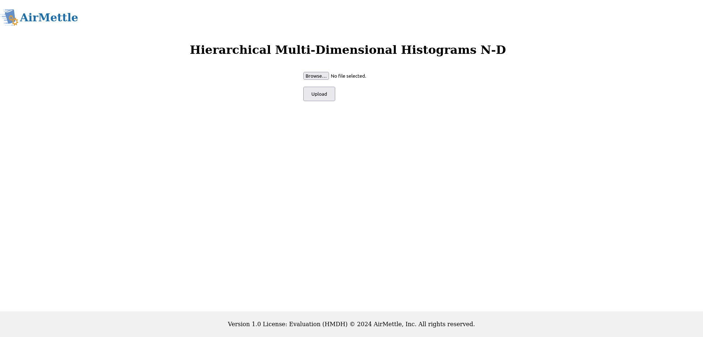
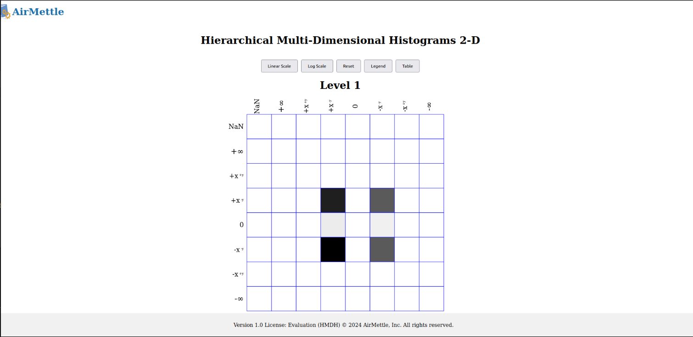
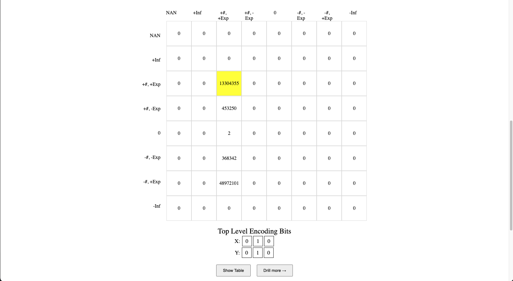
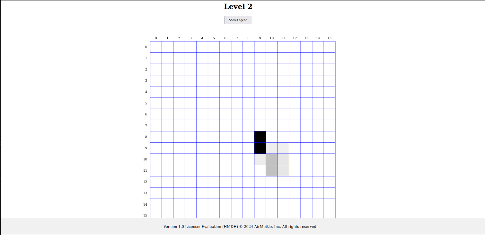
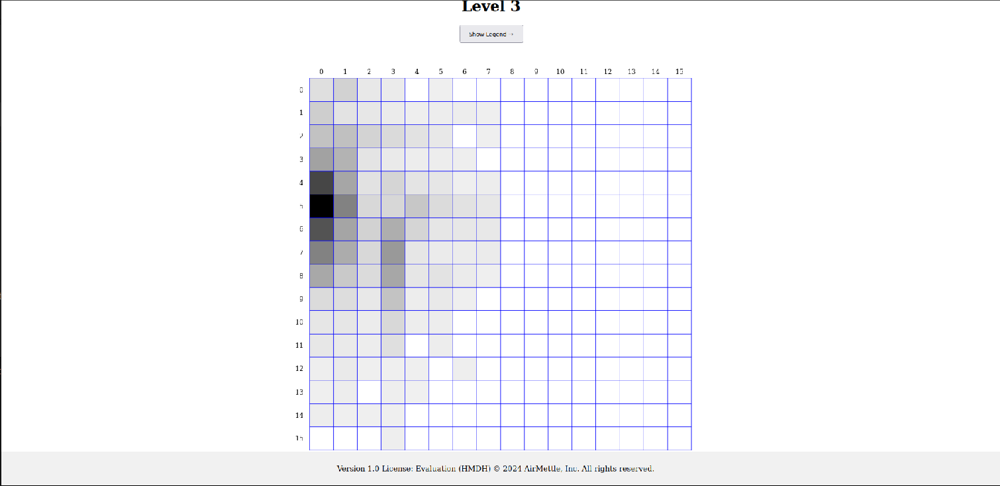

# HMDH

HMDH (Hierarchical Multi Dimensional Histograms) is a library for gathering statistical information on integers and floating point numbers in a space and time efficient manner. The structures can be generated in 1-pass of the data, storing a hierarchical histogram which can efficiently store and present data across multiple orders of magnitude.

## Getting Started
To get started, see [Requirements](#requirements) and [Installation](#installation). See [Usage](#usage) for a full example.

## Requirements
The project has been built and tested on an AWS codebuild instance running `Ubuntu 22.04` with `3 GB memory` and `2 vCPUs` using the image `aws/codebuild/standard:7.0`.

### Installation
This describes the installation process using cmake. As pre-requisites, you'll need git and cmake installed.

```bash
# Clone the repository
$ git clone https://github.com/AirMettle/HMDH.git
# Go to the root of the project
$ cd HMDH
# Install dependencies using these steps
$ cd cmake
$ mkdir build
$ cd build
$ cmake ..
$ make
# Go back to the root of the project
$ cd ../..
# Build the project
$ mkdir build
$ cd build
$ cmake ..
$ make
# Install the project so it is globally available (This step will require sudo priviliges)
$ sudo make install
```

## Usage

### Generate a 1D plots
When you run generate_1DxF it auto generates a CSV file used for 1D plotting. The 1D plotting scripts are located under lib/plotting/Quadrant-Plot.py.

```bash
$ python3 Quadrant-Plot.py <csv-filename>
```

### Generate a 2D buffer

Here is an example CMakeLists.txt to use this library with your project.
```cmake
include_directories(/usr/local/include/)
link_directories(/usr/local/lib)

# Add the main.cpp file
add_executable(Simple2DExample main.cpp)

# Link the library to the executable
target_link_libraries(Simple2DExample HMDH)
```

Construct a `FPHArray` type of your input data. For example:

```cpp
std::vector<double> array = ... // construct your input data as vector 

// pass the vector to `buildFPHArray` as shown below
FPHArray array0 = buildFPHArray(array.data(),
                                  static_cast<int>(array.size()));
```

Pass the constructed `FPHArray`(s) to your desired config (see [API docs](docs/api.md) to learn about other configs). Here is an example to construct a 2D compact histogram buffer:

```cpp
// array0 and array1 are of type FPHArray constructed as shown above.
std::vector<char> compactHistogram = generate_2DxF(array0, array1);
// Persist the compact histogram data on disk.
Write(compactHistogram, "compact2D.bin");
```

### UI
To access the UI run the `hmdh_ui` application that should have been installed following the steps in [Installation](#installation).

```bash
$ hmdh_ui
(2024-10-09 03:02:34) [INFO    ] Crow/master server is running at http://0.0.0.0:18080 using 16 threads
(2024-10-09 03:02:34) [INFO    ] Call `app.loglevel(crow::LogLevel::Warning)` to hide Info level logs.

```

This starts a web server. Switch to your browser and go to `http://localhost:18080`.
This should open up the landing page as shown below.



Click on `Choose File` and select the buffer you generated in the [Generate a 2D buffer](#generate-a-2d-buffer) step. Click on `Upload` to generate the plots for the buffer. This should redirect to a plot similar to the one shown below.









